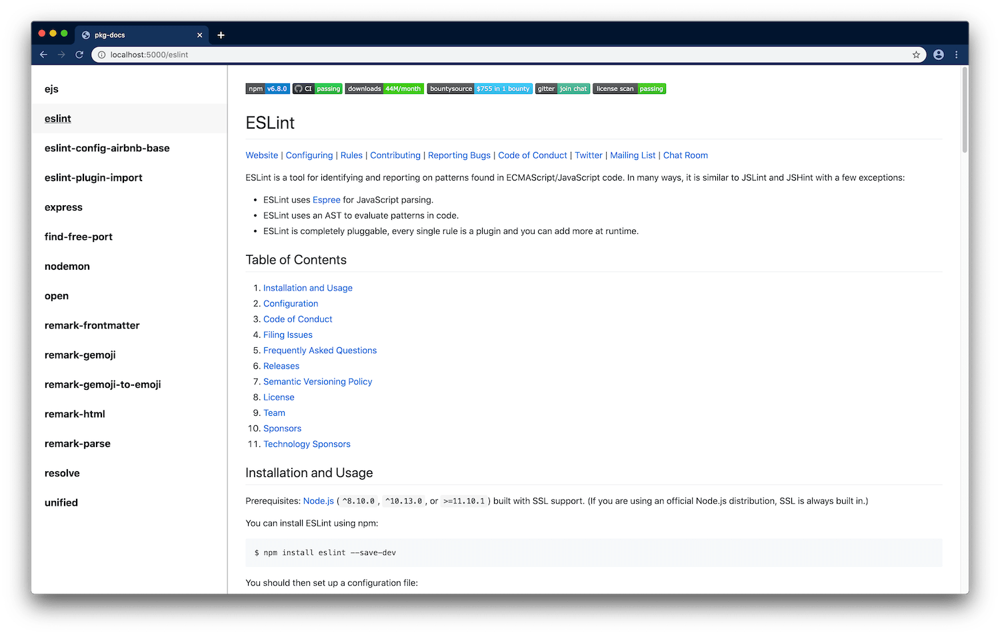

# pkg docs 

Bundles all your readme's into a single web app. It fetches the readme's of the packages in your projects, and transforms them into a GitHub style readable format.

<p align="center">
  
</p>

## Usage

When in the directory of your project run:

```bash
npx pkg-docs
```
